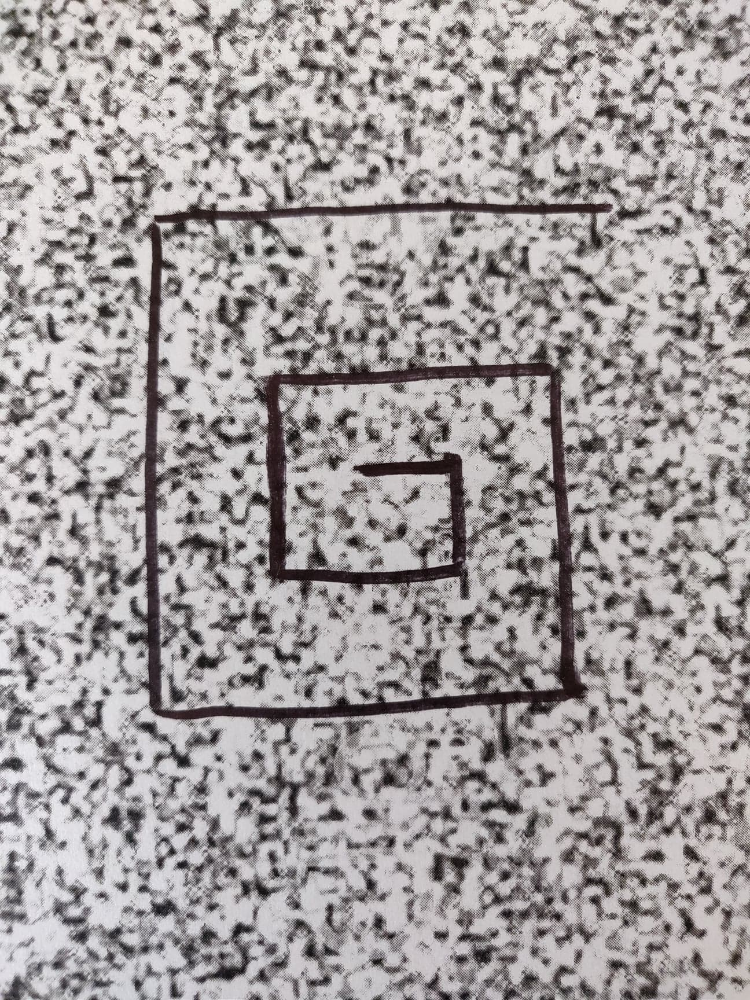
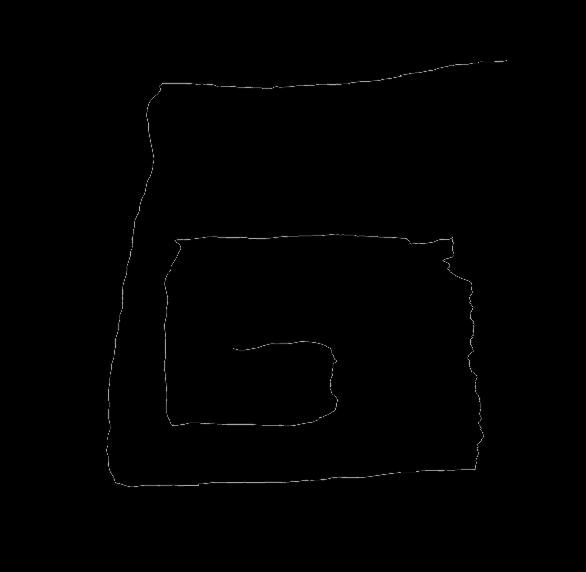

# opticalflow-opencv-android
Uses optical flow analysis to convert real time phone video into motion paths. Images can be generated by two
different optical flow algorithms, farneback (dense) and lucas kanade (sparse).

The app tracks real time video from the camera feed and saves the resulting motion path into the phone's gallery. For best results move the camera under good lighting in a very slow and steady motion under a noisy background.

Sample trace path and corresponding result:

# Resources
[Here's](https://medium.com/@sukritipaul005/a-beginners-guide-to-installing-opencv-android-in-android-studio-ea46a7b4f2d3) a guide on importing the OpenCV library into Android Studio.

It is also advised to check out the [OpenCV official website](https://opencv.org) and the [docs](https://docs.opencv.org/3.0-beta/).
